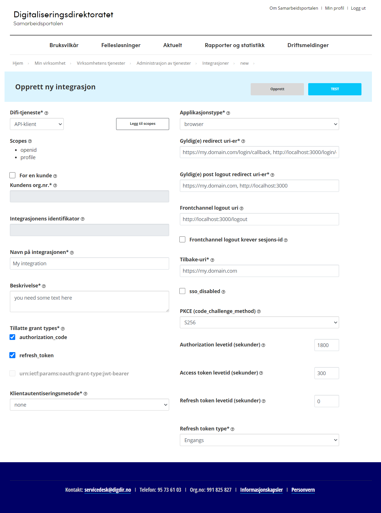

# ID-porten SPA Example
This is a simple application that uses ID-porten for authentication, it presents the user with a login button that takes the user to the ID-porten login page, when the user is successfully authenticated, the users id is displayed.

If the user tries to go directly to the privilege page `/user`, the user is redirected to the login page.

This application is using pattern described in https://docs.digdir.no/docs/idporten/oidc/oidc_auth_spa.html

# Risk
Use at your own risk!

This application will expose the ID-porten access-token to the users browser, there is an risk that the token can be replaced, or manipulated. Do the necessary risk analysis before using this approach.

# Implementation
## 1. Configure ID-porten integration
Login to The Norwegian Digitalisation Agency (Digdir) and create a new application in their portal

1. Go to `https://sjolvbetjening.test.samarbeid.digdir.no/` for dev, or `https://sjolvbetjening.samarbeid.digdir.no/` for production

2. Create a new integration with these parameters:
    - **Difi-tjeneste**: `API-klient`
    - **Scopes**:
        - `openid`
        - `profile`
    - **Tillatte grant types**
        - `authorization_code`
        - `refresh_token`
    - **Klientautentiseringsmetode**: `none`
    - **Applikasjonstype**: `browser`
    - **Gyldig(e) redirect uri-er**: `https://my.domain.com/login/callback, http://localhost:3000/login/callback`
    - **Gyldig(e) post logout redirect uri-er**: `https://my.domain.com, http://localhost:3000`
    - **Frontchannel logout uri**: `http://localhost:3000/logout`
    - **Tilbake-uri**: `https://my.domain.com`
    - **PKCE**: `S256`
    - **Authorization levetid (sekunder)**: `1800`
    - **Access token levetid (sekunder)**: `300`
    - **Refresh token levetid (sekunder)**: `0`
    - **Refresh token type**: `engangs`

    Use the value from **Integrasjonens identifikator** as `VITE_CLIENT_ID` in `.env`

    Your dont need to add any keys or OnBehalfOf-klienter

    ---
    It should look something like this:

    

## 2. Application setup
Copy the `.env.example` to `.env` and add `VITE_CLIENT_ID`
The file [UserManagement.ts](src/UserManagement.ts) configures the necessary env variables needed to use ID porten
[AuthGuard.tsx](src/components/AuthGuard.tsx) makes sure the user is authenticated when a endpoint is called, is the user not authenticated wil the user be sendt to the ID-porten login page

See [main.tsx](src/main.tsx), [App.tsx](src/App.tsx), [index.tsx](/src/pages/index.tsx) and [user.tsx](src/pages/user.tsx) on how the login logic is implemented